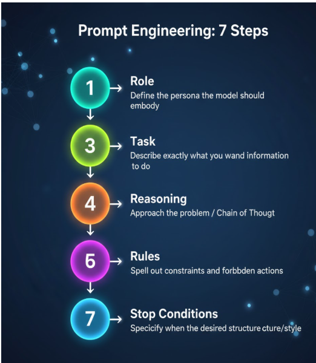

# Prompt-Engineering-

## Introduction

This repository contains a collection of Jupyter Notebook files focused on Prompt Engineering. These files cover various aspects of prompt design, optimization, and use cases for both beginners and advanced users of AI language models. The materials in this repository have been curated from multiple resources and are structured to help anyone grasp the basics and advanced concepts of prompt engineering, whether for simple tasks or complex AI-driven applications.

## What I Have Done

The notebooks in this repository provide comprehensive guides and hands-on practice for different facets of prompt engineering. They cover a range of topics including but not limited to:

- **Expanding Prompts**: Techniques for expanding prompts to elicit more comprehensive responses.
- **Summarization**: Methods for generating concise summaries from longer texts using effective prompts.
- **Inferring**: Best practices for prompting language models to infer and predict data accurately.
- **Iterative Prompt Design**: Refining prompts iteratively for more accurate and context-sensitive responses.
- **Transforming Prompts**: Approaches to transforming the format and structure of prompts to match specific use cases.
- **Guidelines for Good Prompting**: A set of best practices and strategies for formulating effective prompts.
- **The Chat Format**: Techniques specifically designed for engaging in more interactive and conversational prompts.

Each notebook is designed to build upon the previous one, starting from basic prompt engineering concepts and advancing to more sophisticated methods and approaches.

## How to Use

1. **Clone the Repository**: Start by cloning this repository to your local machine:
    ```bash
    git clone https://github.com/yourusername/Prompt_Engineering_Practice.git
    ```

2. **Install Dependencies**: If necessary, create a virtual environment and install the required libraries. For example:
    ```bash
    pip install -r requirements.txt
    ```

3. **Running Notebooks**: Open the Jupyter Notebooks locally or through Google Colab to interact with the examples. You can run each of them step by step to understand the concepts of prompt engineering thoroughly.

4. **Customize Prompts**: Feel free to modify the prompts according to your use case. Experiment with different variations and observe how they influence the responses from AI models.




## Appreciation

I would like to express my gratitude to all the resources and authors who have contributed to the development of prompt engineering techniques. This repository is built upon the knowledge shared by the AI community, and I encourage everyone to continue exploring and expanding the possibilities of prompt-based AI interaction.

Special thanks to:

- https://learn.deeplearning.ai/courses/chatgpt-prompt-eng/lesson/dfbds/introduction


Feel free to open issues or contribute to the repository for any further improvements or additions to the collection.

---

Happy learning and experimenting with prompt engineering!

